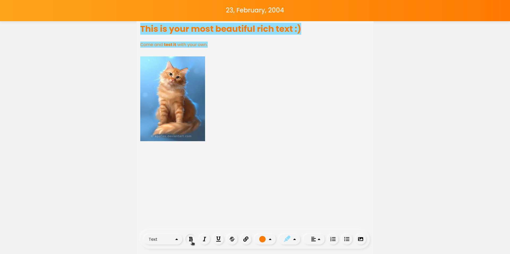

  

<i>"Your best web diary, with an optimized UI/UX and various functionalities."</i>

 
 

  
Contents

  <ol>
    <li>
      <a href="#about-the-project">About the project</a>
      <ul>
        <li><a href="#why-i-made-it">Why did I make it?</a></li>
        <li><a href="#what-i-learned">What I learned?</a></li>
        <ul>
            <li><a href="#technologies-used">Technologies used</a></li>
        </ul>
        <li><a href="#work-in-progress">Work in progress and scalability. 🚧</a></li>
      </ul>
    </li>
    <li><a href="#contributions">Contributions</a></li>
    <li><a href="#license">License</a></li>
    <li><a href="#contact">Contact</a></li>
  </ol>

 

<h2 id="about-the-project">About the project</h2>

WebDiary is a rich text editor still in development, built with SlateJS, aiming to provide a differentiated experience with a beautiful and intuitive interface. It offers a wide range of text editing options, including the ability to add images. Interested? <a href="https://web-diary.vercel.app/" target="_blank">Take a look!</a>

<h3 id="why-i-made-it">Why did I make it?</h3>

Well, my motivations were curiosity and boredom. Curiosity because I always wanted to know the "Under the Hood" of most text editors. That's one of the reasons I chose SlateJS; I wanted something robust and facilitating, closer to a more pure application. I had several disappointments, but I explain that in the <a href="#how-does-it-work">Work in progress and scalability 🚧</a> section. Boredom, because I always find software with a lot of functionality that is genuinely useful in everyday life but lacks in the visual aspect, and I like to reimagine it in my own way.

<h3 id="what-i-learned">What I learned / Technologies used?</h3>

<ul>
    <li>Project Organization and Scalability</li>
    <ul><li>I structured the project using the Atomic Design architecture, focusing mainly on the scalability and reusability of React components, trying to implement Clean Code principles as much as possible.</li></ul>
    <li>SlateJS</li>
    <li>NextJS with a focus on Server Side Rendering</li>
    <li>Styled Components</li>
    <li>React Select</li>
</ul>

<h3 id="work-in-progress">Work in progress and scalability</h3>

Anyway, not everything was smooth sailing; there were various difficulties throughout the project. The SlateJS library I used is unfortunately still in BETA, lacks clarity in its documentation, and suffers greatly in performance and compatibility. I was only able to make the website work on desktop; it is full of bugs on mobile versions, mainly due to the library's architecture. Therefore, I leave this open in case future Thiago is interested in coming back, waiting for the library to improve, or even coming up with a new library. After all, this project is very promising in terms of scalability.

<h3 id="contributions">Contributions</h3>

Feel free to contribute to the project since the code is open :). If you have any questions, just go to the section below and choose a way to get in touch with me.

<h3 id="contact">Contact</h3>

 

